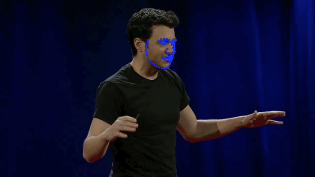

# DEEP SDM

deep-sdm是将经典算法sdm中的HOG特征提取器，以及线性回归器，利用CNN替换后得到的人脸特征点定位算法，有如下特点：
- 在sdm算法中，一般需要至少3个步骤级联，利用CNN模型之后，级联步骤可以缩小到2步，甚至一步到位。可以类比目标检测的two stage和one stage的区别
- sdm算法提取HOG特征之后，总维度较高，导致模型大小通常好几十M，相比之下deep-sdm模型只有3.3M，利用ncnn的fp16存储在不损失精度的情况下，模型大小只有1.8M
- 在MacBook 16-inch CPU上实测能够达到250FPS，利用ncnn移植到移动端能够保持100FPS以上

细节可以参照[知乎文章介绍](!)